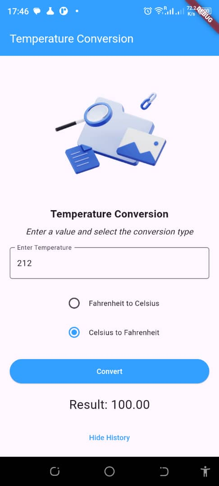
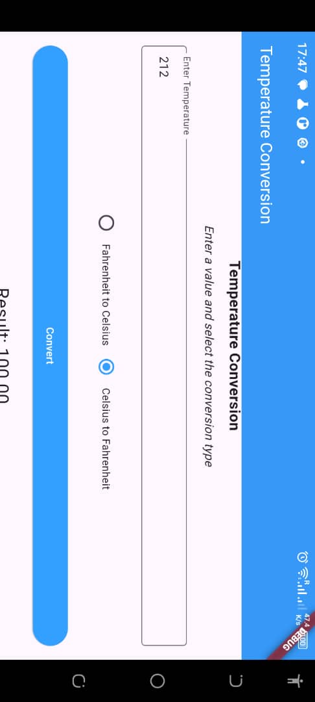

# Temperature Conversion App

A Flutter application for converting temperatures between Fahrenheit and Celsius.

## Features

- Convert temperatures from Fahrenheit to Celsius and vice versa.
- View conversion history.
- Responsive design for both portrait and landscape orientations.
- Simple and intuitive user interface.

## Screenshots




## Getting Started

### Prerequisites

- Flutter SDK installed on your machine.
- Either an Android emulator or iOS simulator set up.

### Installation

1. Clone the repository:

   ```bash
   git clone https://github.com/Isaiah-Essien/Temperature_conversion.git

2. Cd into Temperature_conversion

3. Flutter run

## Link to Video Walk through: https://www.loom.com/share/6ba3fba159084626ad6797766f24dabb?sid=00083994-5557-4378-807b-69f681da35c1
